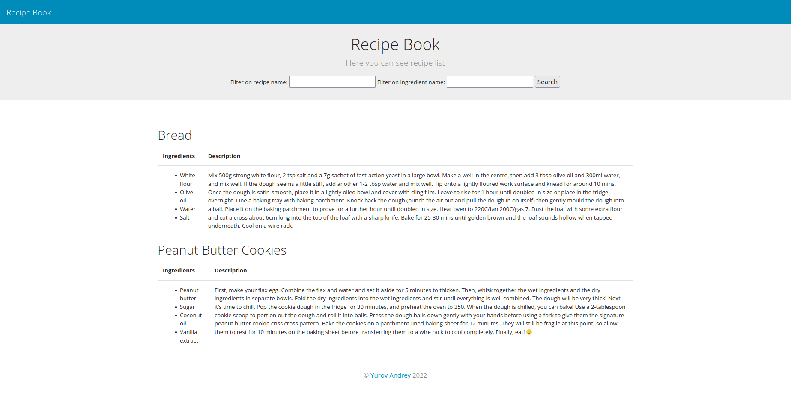

# Recipe Book

Recipe Book with filtering on recipe's and ingredient's name.
The project executes inside docker container. PostgreSQL is used as a database.

## Docker usage

### Project setup

Create `.env` file in the repository root:

```bash
cp .env.dev .env
```

Make adjustments to the environment variables as needed.

### Building of images and startup of containers

Run command in the repository root:

```bash
docker-compose up --build
```
This process may take several minutes first time.

### Stopping of containers

To stop containers ran command:

```bash
docker-compose stop
```

### Project initialization

The commands are executed inside the application container:

```bash
docker-compose exec app bash
```

#### Applying migrations:

```bash
python manage.py migrate
```

#### Assembling statics:

```bash
python manage.py collectstatic
```

#### Creating superuser

```bash
python manage.py createsuperuser
```

#### Adding fixtures

```bash
python manage.py loaddata ingredient recipe
```

Project is available on this link http://0.0.0.0:8000



